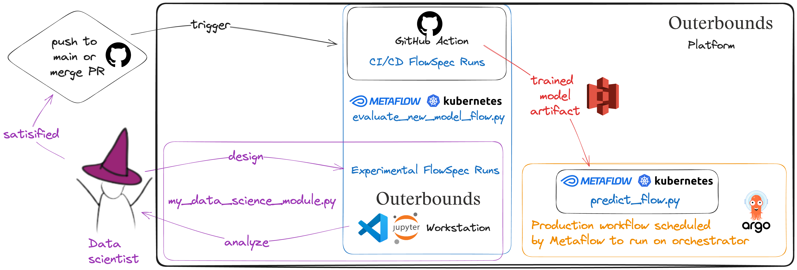
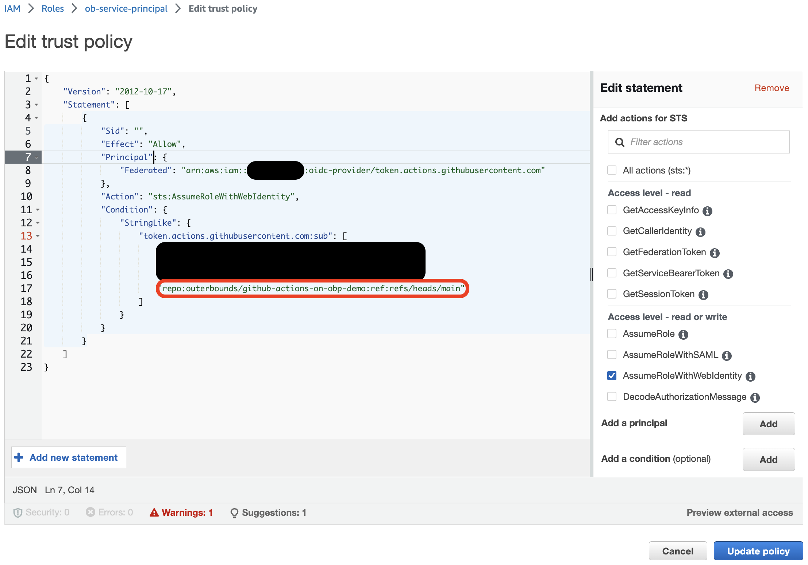

# GitHub Actions on Outerbounds Platform Demo
A basic repo structure to run CI/CD jobs on Outerbounds platform. 

## Related resources
[Github Actions x Outerbounds Service Principals](https://docs.google.com/document/d/1If-Nh4EY4cs5wDihWhnDglE-NKqu8Gv0-ZwXcw4cons/edit)
- This document describes how to set up a Github CI job that can run flows using Outerbounds Service Principals.

## Workflows



[](https://www.youtube.com/watch?v=XnW5MXzMEW8)

### Engineer UX 

#### Initial Setup
This is something the person who handles cloud engineering/security will do once.

##### 1. Find your AWS account ID as instructed [here](https://docs.google.com/document/d/1O0ap2_hnz8VHQqIhiCDUruNCFNKxhiwt9JTWePlYAnc/edit#heading=h.n2f7xpi062t8).
##### 2. Follow this section of the [Allow Github Actions Permissions to Assume your IAM Role](https://docs.google.com/document/d/1O0ap2_hnz8VHQqIhiCDUruNCFNKxhiwt9JTWePlYAnc/edit#heading=h.5cp00dpcus00) part of the [Service Principals guide](https://docs.google.com/document/d/1O0ap2_hnz8VHQqIhiCDUruNCFNKxhiwt9JTWePlYAnc/edit).
##### 3. [Create a new Permission Policy for Service Principals](https://docs.google.com/document/d/1O0ap2_hnz8VHQqIhiCDUruNCFNKxhiwt9JTWePlYAnc/edit#heading=h.p55n5nuncamf).
##### 4. [Create a Service Principal in Outerbounds UI](https://docs.google.com/document/d/1O0ap2_hnz8VHQqIhiCDUruNCFNKxhiwt9JTWePlYAnc/edit#heading=h.tdalusawlhk1).

#### Modifying or adding a new CI/CD task in your action
This is a pattern that may require the end user who writes code that goes into the tasks of a FlowSpec run to communicate with the person who manages cloud engineering/security. It is the place where the security to run the action using the Outerbounds platform service principal connects to the logic that:
- runs the GitHub action CI job that runs the FlowSpec,
- deploys a new FlowSpec to a production branch or an experimental branch for A/B & multi-armed bandit scenarios. You might use the Metaflow [client API](https://docs.metaflow.org/api/client) to determine when the run has met some criteria.

#### The workflow
##### 1. Identify the GitHub organization containing the repository where you want to add a new GitHub action. For example, this repository would be the “outerbounds” organization and “github-actions-on-obp-demo” repository.
##### 2. Go to step 5 and 6 of the [Create and Configure your IAM Role](https://docs.google.com/document/d/1If-Nh4EY4cs5wDihWhnDglE-NKqu8Gv0-ZwXcw4cons/edit) section, and follow instructions to add the action you want to the trust policy of your service principal IAM role. For example: here we define an action that runs when new code is pushed directly or merged to the main branch of the repository.



##### 3. [Define the GitHub action](https://docs.google.com/document/d/1O0ap2_hnz8VHQqIhiCDUruNCFNKxhiwt9JTWePlYAnc/edit#heading=h.shunrk8q1a9d) in your GitHub repository with your FlowSpec code and its dependencies.

There are two key pieces to look at in the example at `.github/workflows/assess_new_production_model.yml` to get this to work for your service principal. Descriptions are annotated inside `<>` in the following snippet. You will find the ARN in your AWS account in the IAM Role for the service pricipal, and you will find your Outerbounds configure command in the Outerbounds platform UI where you have connected the service principal to your account as a machine identity.
```
name: Deploy new production model

...

jobs:
  deploy:

    ...
    
    steps:
    - uses: actions/checkout@v2
    - name: Configure AWS Credentials
      uses: aws-actions/configure-aws-credentials@v1
      with:
        role-to-assume: <YOUR SERVICE PRINCIPAL ROLE ARN>
    
    ...
    
    - name: Test flow
      
      ...
      
      run: |
        <YOUR OB CONFIGURE COMMAND FOR SERVICE PRINCIPALS>
        python evaluate_new_model_flow.py run --with card
```


### Data Scientist UX
Our goal is to update the model used in the `Predict` workflow defined in `prediction_flow.py`. As a starting point for the CI/CD lifecycle, consider how a data scientist iterates locally or on a cloud workstation.

This repository demonstrates how the data scientist can:
- take the result of such experimentation, 
- create a GitHub branch, 
- let an automatic CI/CD process built with GitHub Actions validate the model's quality (using Outerbounds platform resources), 
- and only if the new model code meets certain user-defined criteria, automatically deploy the newly trained model to be used in the production workflow that makes predictions accessed by other production applications.


### Deploy the `Predict` workflow to production
A data scientist or ML engineer would do this rarely, and typically less frequently than the model selction/architecture in `my_data_science_module.py` updates.
This only needs to be done if the code in `predict_flow.py` file updates.
```
python predict_flow.py --production argo-workflows create
```

#### Manually trigger the production workflow
This is a way to manually trigger a refresh of the production run that populates the model prediction cache accessed by other production applications.
```
python predict_flow.py --production argo-workflows trigger
```

### Development phase: Local iteration on `EvaluateNewModel`
Local/workstation testing:
```
python evaluate_new_model_flow.py run
```

### Moving to production phase: a template for a CI/CD process using GitHub Actions
When a data scientist is satisfied with what they see on local runs, then they can use GitHub commands like a regular software development workflow:
```
git switch -c 'my-new-model-branch'
git add .
git commit -m 'A model I think is ready for production'
git push --set-upstream origin my-new-model-branch
```

After the model is pushed to the remote branch of `my-new-model-branch`, the data scientist or an engineering colleague can open a pull request against the main branch. When this pull request gets merged to the `main` branch of the repository, a GitHub action defined in `.github/workflows/assess_new_production_model.yml` is triggered. To explore the many complex patterns like this you can implement with GitHub actions, consider step 5 of the [Create and Configure your IAM Role](https://docs.google.com/document/d/1If-Nh4EY4cs5wDihWhnDglE-NKqu8Gv0-ZwXcw4cons/edit) section, and the many types of [events you can use to trigger a GitHub Action](https://docs.github.com/en/actions/using-workflows/events-that-trigger-workflows).

The GitHub Action in this template will do the following:
1. Run the `EvaluateNewModel` workflow defined in `evaluate_new_model_flow.py`.
2. If the `EvaluateNewModel` workflow produces a model that meets some user-defined criteria (e.g., beyond some performance metric threshold), then tag the Metaflow run in which the model was trained as a `deployment_candidate`.
3. If the upstream `EvaluateNewModel` run is tagged as a `deployment_candidate` and the model meets any other criteria you add to this template, then the production workflow will use a new version of the model in the `predict.py` flow in an on-going fashion.